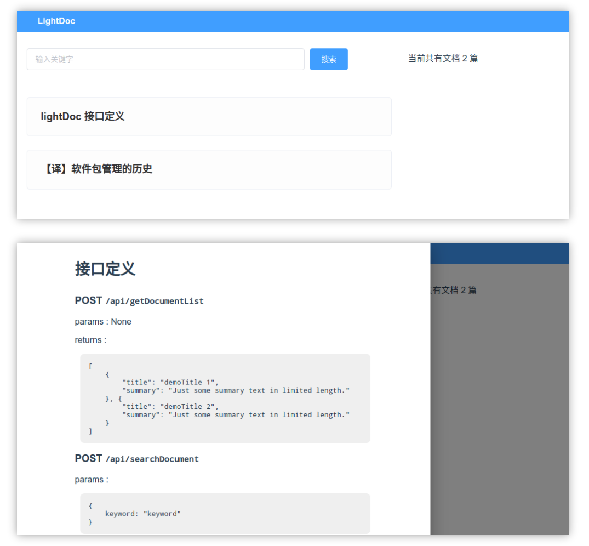

> 为什么要用英文写 readme 和 commit 信息？——为了顺手提升我的英语水平


# light-doc

Super lightweight personal markdown document host

Welcome all kind of contributions ! If you want to, check the **What to do next?** part below to find the thing you're interested in. Then open an issue to discuss with me


## Features

- Easily show your markdown documents in browser: Put your `.md` files with the server JavaScript file, done!




## How to deploy in debug mode

1. Install Node.js ( Ask your favorite search engine if you don't know how to )
2. Clone this repo: `https://github.com/marsCatXdu/light-doc.git`
3. Get in the folder
4. Open terminal or cmd in this folder, run command: `npm install`
5. Start frontend `npm run serve`
6. Get in server code folder and start server: Open another terminal or cmd and run: `cd backend`, `node ./lightdocServer.js`


## What to do next ?

- Rewrite the server with Python Flask.
- Add image support.
- Improve the markdown rendering . It can't show tables now. We may have to use something else to replace the using "showdown".


## Web APIs

### POST `/api/getDocumentList`

params : None

returns :

```json
[
	{
		"title": "demoTitle 1",
		"summary": "Just some summary text in limited length."
	}, {
		"title": "demoTitle 2",
		"summary": "Just some summary text in limited length."
	}
]
```


### POST `/api/searchDocument`

params :

```js
{
	keyword: "keyword"
}
```

returns :

```json
[
	{
		"title": "demoTitle keyword 1",
		"summary": "Just some summary text in limited length."
	}, {
		"title": "demoTitle keyword 2",
		"summary": "Just some summary text in limited length."
	}
]
```


### POST `/api/getDocument`

params :

```js
{
	title: "demoTitle 1"
}
```

returns :

```json
{
	"title": "demoTitle 1",
	"summary": "summary text....",
	"content": "markdown document text"
}
```

